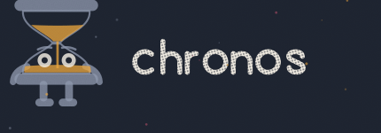
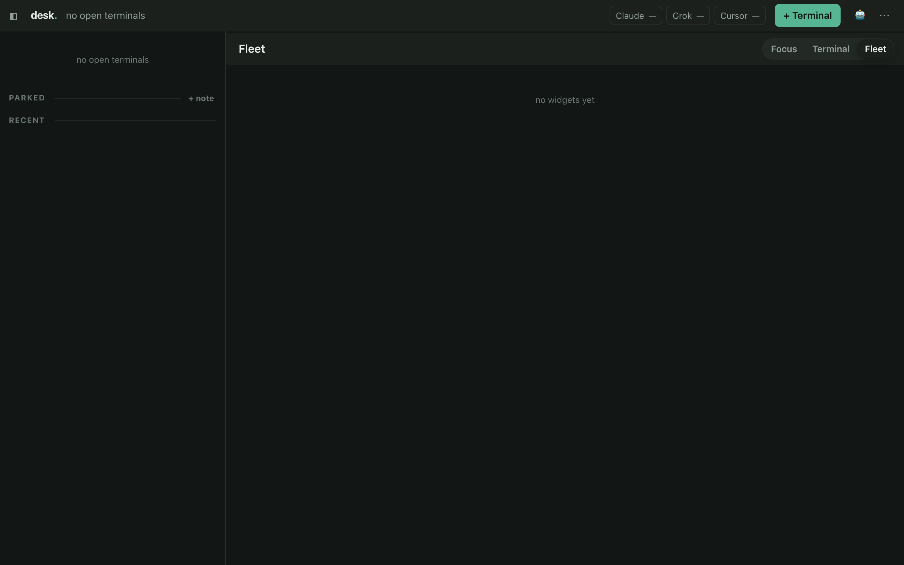
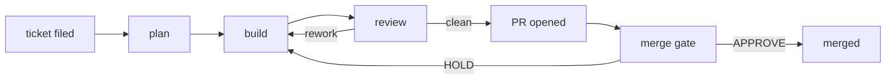
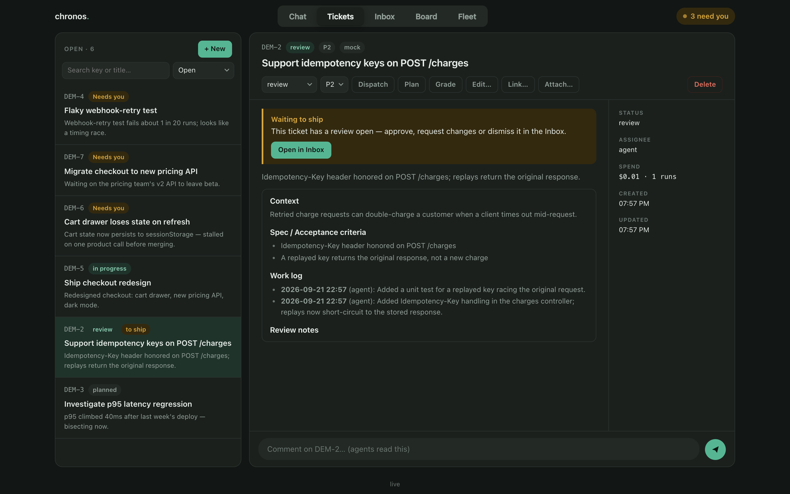
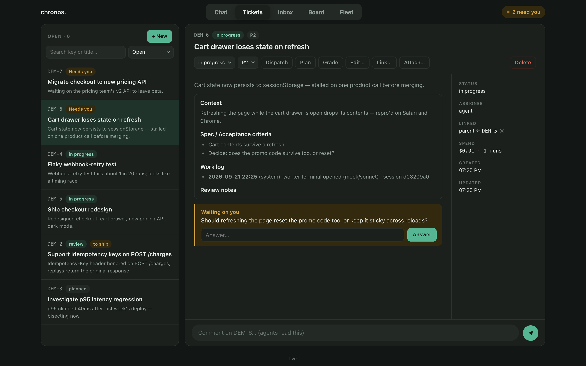
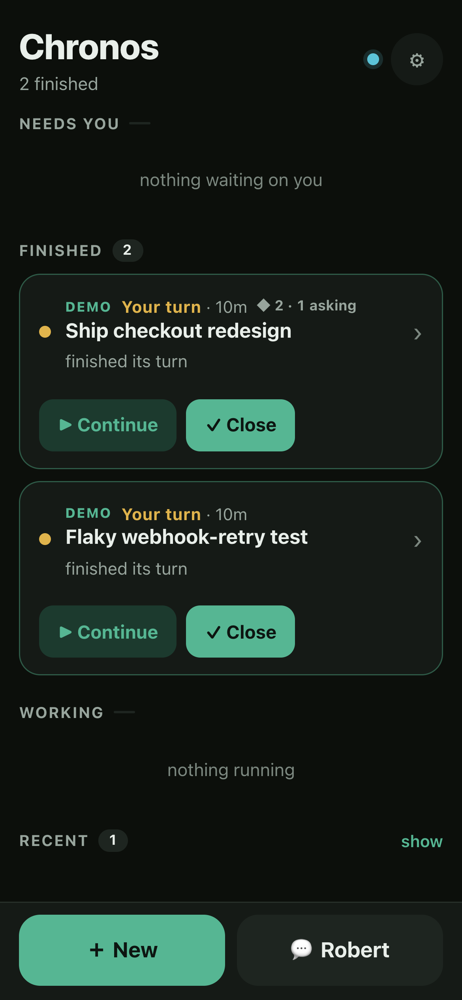

<p align="center">
  
</p>

<h1 align="center">Chronos</h1>

<p align="center"><strong>A local daemon that runs AI coding agents unattended, and supervises them like a team.</strong></p>

<p align="center">
  <a href="LICENSE"></a>
  <a href="https://github.com/leorfer23/getchronos/actions/workflows/ci.yml"></a>
  =22">
  
</p>

<p align="center">
  <a href="#quickstart">Quickstart</a> ·
  <a href="#how-it-works">How it works</a> ·
  <a href="#documentation">Docs</a>
</p>
<!-- TODO(domain): add landing link to nav once one is picked -->

<p align="center">
  
</p>

<p align="center">
  <sub>
    <a href="#quickstart">Quickstart</a> ·
    <a href="#your-first-project">Your first project</a> ·
    <a href="#the-shape-of-it">The shape of it</a> ·
    <a href="#how-it-works">How it works</a> ·
    <a href="#is-this-for-you">Is this for you?</a> ·
    <a href="#what-is-actually-interesting-here">What's interesting</a> ·
    <a href="#surfaces">Surfaces</a> ·
    <a href="#backends">Backends</a> ·
    <a href="#guardrails-honestly">Guardrails</a> ·
    <a href="#faq">FAQ</a> ·
    <a href="#documentation">Documentation</a>
  </sub>
</p>

---

You give it a project, a repo, and a ticket. It picks a model, opens a git worktree, spawns an agent
CLI headless, watches the transcript for signs it has stalled, lets it stop and ask you a question,
reviews the diff, opens the PR, and tells you what happened. Everything is a SQLite row on your own
machine and every agent process is a child of one Node daemon you can `kill`.

It drives whichever CLI you already pay for — **Claude Code, Codex, Cursor, Grok, opencode** — behind
one interface, so a cheap model can grade a ticket and an expensive one can build it.

> **What this is not.** It is not a hosted service, a CI system, or a product with a support
> contract. It was built for one operator on one always-on Mac, it is opinionated, and parts of it
> only make sense once you have watched an agent do something stupid at 3am. It is open because the
> patterns are worth stealing.

---

## Quickstart

Requires Node 22+, macOS (the sandbox is Seatbelt), and at least one agent CLI installed and logged
in.

```bash
git clone https://github.com/leorfer23/getchronos.git && cd getchronos
npm ci
npm start
```

Open <http://localhost:7777/desk>. That is the whole install: no configuration file, no database to
create, no account. The daemon boots with an empty environment and tells you which optional
features are off and how to turn them on. The Desk is empty until you add a project — next section.

**Before pointing this at a repo you care about**, read [CONFIGURATION.md § the five minutes that
matter](./CONFIGURATION.md). Spend is uncapped by default; copy `.secrets.example` → `.secrets` and
set at least `CHRONOS_DAILY_BUDGET` and `CHRONOS_PROTECTED_DIRS_EXTRA`.

---

## Your first project

There is no Spaces form yet — create the project and attach a repo via the admin API (or ask Robert
in the Desk chat to run the same calls). `.admin-token` is written next to the code on first boot;
never commit it.

```bash
TOKEN=$(cat .admin-token)
PORT=${CHRONOS_PORT:-7777}
AUTH=(-H "x-mc-admin: $TOKEN" -H "content-type: application/json")

# 1. Create a project (workspace). Pin the CLI profile that should be billed for it.
WS=$(curl -sS "${AUTH[@]}" -X POST "http://localhost:$PORT/api/workspaces" \
  -d "{\"slug\":\"personal\",\"name\":\"Personal\",\"config_dir\":\"$HOME/.claude\"}")
echo "$WS" | tee /tmp/chronos-ws.json
WS_ID=$(echo "$WS" | python3 -c 'import sys,json; print(json.load(sys.stdin)["id"])')

# 2. Attach a checkout. delivery=pr opens PRs; default_branch is used when omitted from git.
#    path must be an absolute path to an existing git checkout on this machine.
curl -sS "${AUTH[@]}" -X POST "http://localhost:$PORT/api/workspaces/$WS_ID/repos" \
  -d "{\"name\":\"my-app\",\"path\":\"$HOME/code/my-app\",\"delivery\":\"pr\",\"default_branch\":\"main\"}"
```

Same thing via Robert (Desk chat composer, bottom of `/desk`):

> create a project slug=personal name=Personal config_dir=~/.claude, then add repo my-app at
> ~/code/my-app with delivery=pr and default_branch=main

### Open a terminal and watch it

1. Reload `/desk`. The project appears in the quick-bar client dropdown (leftmost select).
2. Pick **Personal**, leave the CLI/model defaults (or choose Claude / Cursor / Grok).
3. Type a goal — e.g. `list the top-level files and stop` — and press ⏎.
4. The rail grows a card (state chip + one line). Open it: **Focus** is the plain-English story
   (`Understanding:` → narration → `Summary:`); the raw PTY is beside it if you want the tools.

Blank terminal (no seed): empty ⏎. Full spawn dialog (cwd, brief, kind): ⇧N.

<details>
<summary>Run it for real: on boot and across crashes (launchd)</summary>

```bash
npm run install:launchd          # renders launchd/*.plist.template for this machine and loads it
npm run install:launchd -- --all # also overlay, whisper, cloudflared — skips whatever isn't installed
```

The plists are generated rather than committed, because a committed one hardcodes another machine's
home directory, checkout path and node binary. The installer records the **absolute path of the node
that ran it**, so the daemon always uses the runtime `node_modules` was built against —
`better-sqlite3` is native and aborts on a major-version mismatch. Re-run it after changing node
version or moving the checkout.

</details>

---

## The shape of it

**A project** (`workspace` in the schema and API) is whatever you want it to be: one repo, a product
across several repos, a client, or a side project. It is the unit of isolation — its own tickets,
memory, budget, sandbox rules, credentials, and its own account.

**A repo** belongs to a project and carries its delivery rules: default branch, whether work ships
as a PR or a direct push, its Definition of Done, the commands that must pass before review.

**A ticket** is a commitment. It has a key (`API-14`), a lifecycle, and a file on disk that is the
thing an agent actually reads. Tickets can mirror to Jira or ClickUp.

**A run** is one agent process working one stage of one ticket. Plan, build, review, grade, CI-fix
and merge-gate are all runs; they differ in the prompt, the tools they are allowed, and whether they
may write anything at all.

**A terminal** is the other half. Not everything should be headless — a live PTY on the Desk is the
same agent with you watching, and a headless run can be interrupted into one mid-flight
(`POST /api/runs/:id/continue`) without losing its context.

---

## How it works

Sixty seconds, start to finish:

1. You file a ticket (`mc ticket new`, or the Desk composer) — a title, a body, a repo.
2. **plan** grades its difficulty 1–5; that grade routes the build to a model tier
   (`CHRONOS_ROUTE_MODELS`).
3. **build** opens its own git worktree and does the work on a `mc/<key>` branch — it does not push
   or open anything yet.
4. **review** reads the diff. Not satisfied → back to **build** with every unresolved point fed in
   full, oldest first, so a fix round can't re-break what an earlier one demanded. Approved →
   `shipPR()` commits, pushes the branch and runs `gh pr create`.
5. On a project with the merge gate on, it re-checks CI itself and writes `MERGE-GATE: APPROVE` or
   `MERGE-GATE: HOLD` against the PR — `APPROVE` merges it, `HOLD` sends it back to **build**. Without
   the gate, green CI merges on its own (`CHRONOS_AUTO_MERGE`, on by default).



<p align="center">
  
</p>

`src/tickets.ts`, `src/dispatcher.ts`, `src/reviews.ts`, `src/merge-gate.ts`, `src/delivery.ts`

---

## Is this for you?

**Yes, if:**
- You already pay for at least one agent CLI (Claude Code, Codex, Cursor, Grok, or opencode) and
  want it running unattended instead of babysat.
- You run on one always-on Mac and are fine with a kernel-enforced (Seatbelt) sandbox, not a
  container or VM.
- You're comfortable being the on-call human — approving asks, reading SQLite directly, tuning
  budgets and protected directories yourself.
- You want tickets to ship as real PRs (or direct commits) with a review gate in front of merge, not
  a black box that pushes to `main` on its own.
- You're fine with no configuration UI yet — the admin API and the Desk chat (Robert) are the
  interface.

**No, if:**
- You want a hosted service, a support contract, or a team product with roles and seats — none of
  that exists here (see "What this is not" above).
- You need sandboxing on Windows or Linux — the sandbox is macOS/Seatbelt only; other platforms run
  the daemon unsandboxed, and it logs a warning for every job that hits that path (`src/sandbox.ts`).
- You want spend capped by default — `CHRONOS_DAILY_BUDGET` is opt-in, not a starting guardrail.
- You want a polished onboarding wizard — there's no Spaces form yet; the first project is created
  with `curl` or a copy-pasted Robert command (see [Your first project](#your-first-project)).

---

## What is actually interesting here

Most of this exists because something went wrong once. These are the parts worth reading even if you
never run the daemon.

### Agents cannot read the credentials they use

An agent that can read a token can leak it. So the sandbox denies the credential outright, and the
daemon makes the authenticated call on the agent's behalf — either through an explicit broker
endpoint, or **transparently**: the project's egress proxy terminates TLS with a local CA, injects
the header, and re-originates a verified connection upstream. `git push` and plain `curl` work; the
token never enters the sandbox. The CA is never installed in the system keychain, only handed to the
daemon's own children, and both its private keys are in the sandbox deny list.

`src/egress.ts`, `src/egress-mitm.ts`, `src/egress-ca.ts`, `src/broker.ts`

### One worktree per agent

Two agents in one checkout is data loss with extra steps. Every ticket build gets its own git
worktree, created and cleaned up by the daemon, so parallel work cannot fight over a branch or a
dirty tree.

`src/worktrees.ts`

### A stalled agent files a card; it does not retry

Nothing here retries on its own. When a run stops emitting progress, the supervisor kills it and
files an approval card — you decide. That is a deliberate refusal of the obvious feature: an
automatic retry on a run that failed for a real reason is just the same failure again, twice as
expensive, and you find out in the morning.

`src/monitor.ts`, `src/recovery.ts`

### An agent can stop and ask

`mc ask` parks a run on a human question instead of guessing. The question goes to the coordinator
first, who answers it if it is derivable from the project's own memos and escalates to your phone if
it is not. Read-only runs never park — a planner that waits is a slot held for nothing.

<p align="center">
  
</p>

`src/asks.ts`, `src/ask-robert.ts`

### The prompt is asserted, not assumed

What an agent is told is assembled from a dozen sources, and deleting a section fails **silently** —
it looks like the model getting worse. `evals/` replays fixture tickets through the real dispatch
path and asserts the standing protocol survived: the progress instructions, the ask, the handoff
template, the repo's Definition of Done, every rework round in order.

`evals/`

### Every rework round, oldest first

A ticket once oscillated for three rounds because the builder was only ever shown the latest
reviewer verdict, and each fix re-broke what an earlier round demanded. Reviews are now fed in full,
in order, with an explicit instruction to satisfy all of them at once.

`src/tickets.ts`, `evals/cases/rework.json`

### Memory that is a file you can read

Each project has memos: a standing brief you write, and a learnings file the agents append to. They
are rows in SQLite, mirrored one-way to `notes/<project>/*.md` so you can grep and diff them. The
daemon compacts them when they grow and injects the relevant parts by FTS relevance rather than
pasting everything into every prompt.

`src/notes.ts`, `src/recall.ts`, `src/hygiene.ts`, `src/lessons.ts`

### One account per project

A profile is a CLI config directory — its own login, settings, skills and MCP servers. A project
pins one, and that pin beats every default, so one client's work is never billed to another's
account or handed another's tools. Profiles are discovered: every `~/.claude-<name>` directory is
offered under that name.

`src/config.ts`, [CONFIGURATION.md](./CONFIGURATION.md)

---

## Surfaces

| | |
|---|---|
| **Desk** (`/desk`) | the main one — live terminals as a wall of cards, each a real PTY |
| **Phone** (`/phone`) | a PWA behind your own authenticating tunnel ([Cloudflare setup](./CONFIGURATION.md#4-optional-reach-it-from-your-phone)); triage from bed |
| **Overlay** (`/overlay.html`) | a small always-on-top native panel, see `desktop/README.md` |
| **Telegram** | control + notifications with no inbound port, via long-polling |
| **`mc` CLI** | what agents themselves use: `mc steps`, `mc ask`, `mc review`, `mc learn` |
| **REST + WebSocket** | everything above is a client of this |

<p align="center">
  
</p>

The Telegram bot is off until `CHRONOS_TG_TOKEN` is set. `relay/` is an optional Cloudflare Worker
that gives you remote triggers without opening a port — the daemon dials **out** to it.

---

## Backends

| backend | binary | notes |
|---|---|---|
| `claude-code` | `claude` | default; the richest transcript stream |
| `codex` | `codex` | |
| `cursor-agent` | `cursor-agent` | |
| `grok` | `grok` | also the default rate-limit fallback |
| `opencode` | `opencode` | gateway to whatever it is configured with |
| `openai-api` | — | the API directly, no CLI |
| `mock` | — | a scripted stand-in (`node -e`, zero tokens) that drives the real dispatch path in tests |

Adding one is a module in `src/backends/` and a line in its registry.

Chronos drives each CLI's own binary, so you bring your own auth for each. A project declares which
backends it may use, and `CHRONOS_ROUTE_MODELS` maps a ticket's graded difficulty to a
`backend:model` — so a trivial ticket does not get an expensive model just because it was filed
first.

---

## Guardrails, honestly

Jobs run with `--dangerously-skip-permissions`. That is what unattended autonomy means, and
everything below exists to bound it.

**Sandbox** (per job: `off` / `guard` / `strict`). `guard` is the default: the job's own `cwd` is
granted, secrets and other project directories are denied, kernel-enforced via Seatbelt and
inherited by every subprocess the agent spawns. `strict` adds write-confinement and a network
lockdown. **This is macOS-only** — on any other platform jobs run unsandboxed and the daemon does
not pretend otherwise.

Sibling-project isolation **has no portable default**: checkout locations differ per machine, so
until you set `CHRONOS_PROTECTED_DIRS_EXTRA` an agent in one project can read another's files. The
daemon warns about this at every boot.

**Also enforced:** wall-clock timeout per run, per-run budget, daily budget, concurrency cap, and
the burn guard — which halts the fleet on runs/hour and $/hour, because a runaway can spend a whole
day's budget in four minutes and a total-only cap notices too late.

**Advisory, not a boundary:** `allowed_tools` under skip-permissions, and the prompt-injection guard
that redacts patterns in text arriving from outside the system. Treat anything an agent reads from a
tracker, an issue, or the web as untrusted input.

`sandbox-exec` is Apple-deprecated. It still works, and Chronos falls back to `off` if it is ever
removed — loudly.

See [SECURITY.md](./SECURITY.md) for the threat model and how to report a problem.

---

## Documentation

| | |
|---|---|
| [ARCHITECTURE.md](./ARCHITECTURE.md) | the design: execution model, data model, API, relay |
| [CONFIGURATION.md](./CONFIGURATION.md) | every environment variable, grouped, with defaults |
| [LEADS.md](./LEADS.md) | Leads — a Robert for one goal, driving its own worker terminals |
| [MISSION-CONTROL.md](./MISSION-CONTROL.md) | tickets, reviews, the board, worker visibility and HITL |
| [CLAUDE.md](./CLAUDE.md) | the gotchas — read before changing code |
| [CONTRIBUTING.md](./CONTRIBUTING.md) | how to work on it |
| [SECURITY.md](./SECURITY.md) | threat model, reporting |
| `agents/README.md` | how an executive is defined |
| `notes/example/README.md` | the three memos and what belongs in each |
| `relay/README.md`, `desktop/README.md` | the optional pieces |

---

## FAQ

**What does it cost to run?**
Whatever your own CLI subscriptions or API usage already cost you — Chronos adds no fee of its own.
It tracks spend per run (`mc cost`), but the cap is opt-in: `CHRONOS_DAILY_BUDGET` defaults to `0`
(uncapped). See [CONFIGURATION.md](./CONFIGURATION.md).

**Does it run on Linux?**
CI runs on `ubuntu-latest` as well as `macos-latest` (`.github/workflows/ci.yml`), so the daemon
itself works there — the SBPL-profile assertions skip off macOS since they read a sandbox profile
that only exists there (commit `cc0d386`); everything else, including the credential-boundary
tests, runs on both. What doesn't run at all on Linux: the sandbox (`guard`/`strict`) is Seatbelt, a
macOS-only mechanism — on any other platform jobs run **unsandboxed**, and the daemon logs a warning
for each job that hits that path (`src/sandbox.ts`).

**Which agent CLIs does it drive?**
`claude-code`, `codex`, `cursor-agent`, `grok`, `opencode`, plus `openai-api` directly with no CLI —
see [Backends](#backends). You bring your own auth for each.

**Where does my data live?**
On your machine: SQLite for state, `notes/<project>/*.md` for memory, git worktrees for the actual
work. There is no Chronos-operated server for any of it to go to.

**How do I stop it?**
Kill the daemon process — it's a single Node process and every agent is its child — or
`POST /api/runs/:id/kill` for one run. There is no `/stop` endpoint.

---

## Licence

Apache 2.0. See [LICENSE](./LICENSE).
